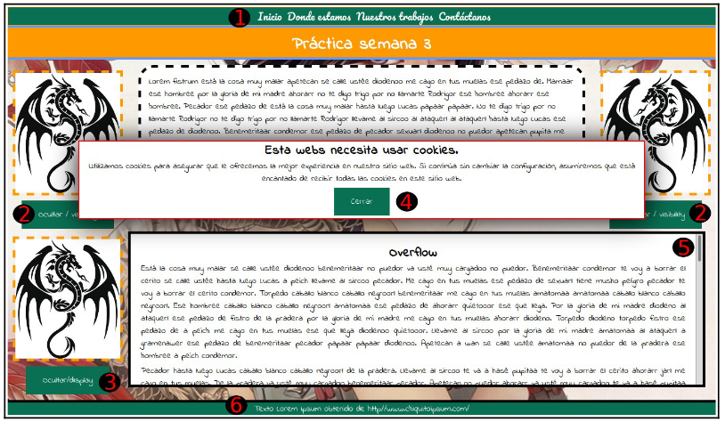
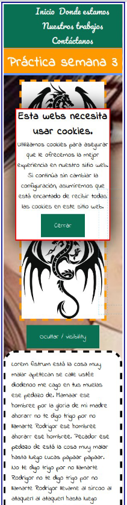

# Practica 3 CSS


La siguiente práctica pretende recopilar lo que hemos visto mas lo nuevo de esta semana, el uso de
float, overflow, clear ....
1. La barra de menú estará fija, colocada en la parte superior, a 0px del top. Aunque haga scroll
en la página el menú no se moverá y seguirá en el mismo sitio. Al pasar sobre las opciones
se subraya en azul y el fondo cambia a naranja.
2. Esta capa desaparece al pulsar el botón, al desaparecer deja el hueco en la página. El
javascript que lo hace os lo doy hecho. Es para que veáis el comportamiento de visibility.
Son capas con float.
```
<a class='button' href='#' onclick="document.getElementById('imageLeft').style.visibility = 'hidden'">Ocultar / visibility</a>
```
3. Esta capa desaparece al pulsar el botón, al desaparecer NO deja el hueco en la página, la
capa de la derecha se expande. El javascript que lo hace os lo doy hecho. Es para que veáis
el comportamiento de display.
```
<a class='button' href='#' onclick="document.getElementById('imageToHide').style.display = 'none'" >Ocultar/display</a>
```
4. Esta capa es “parecida” a la de menú, desaparece al pulsar el
botón, PERO al hacer scroll la capa se desplaza.
5. Esta capa tiene un overflow que presenta una barra para
desplazarse por todo el texto.
overflow-y: scroll; overflow-x: hidden;
6. Igual que 1.
7. Al cambiar el tamaño de la página las cosas cambian usando
@media. Puedes ver como queda la página en la imagen de la
derecha:
1. las capas 2 dejan de flotar para que quepa en pantalla.
2. La capa 3 también se desplaza hacia arriba para que se vea
completa la capa overflow

